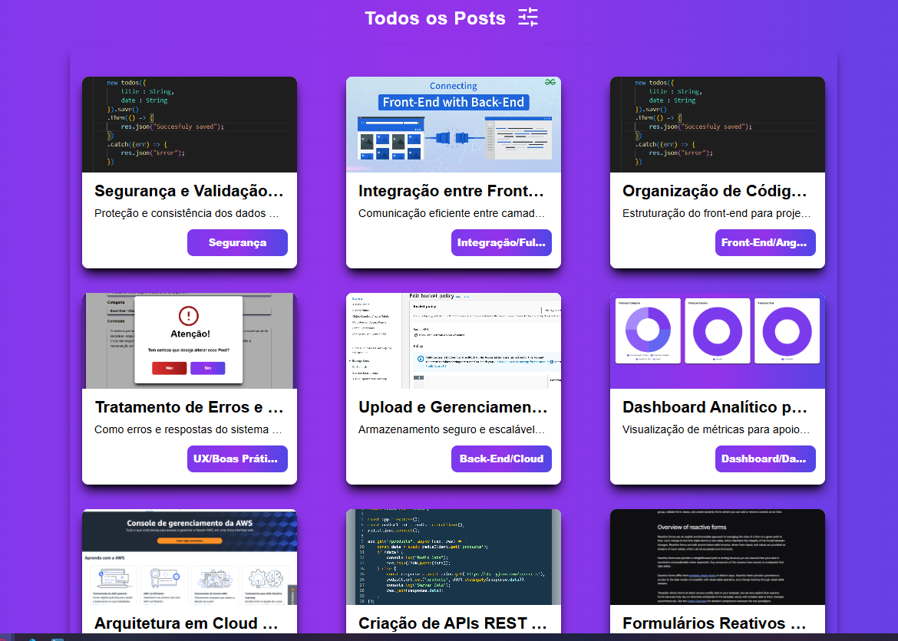
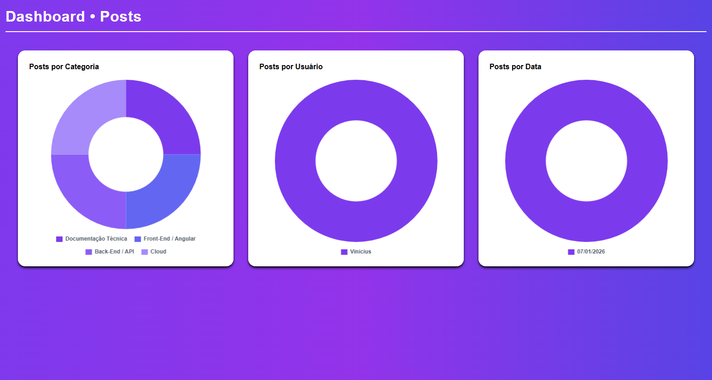

# 👋 Olá, eu sou Vinicius Vicente

### Desenvolvedor Front-End Júnior | Junior Frontend Developer

💻 Criando interfaces modernas, responsivas e escaláveis com **React, Angular, TypeScript, TailwindCSS, HTML e CSS**.  
🌐 Experiência em projetos fullstack com **Node.js, MySQL, PostgreSQL e AWS**, conectando front-end a dados e deploys na nuvem.  

---

## 🚀 Stack Principal

---

## 💼 Experiência Profissional

### Selbetti Retail Experience (Antiga Pricefy) · Analista de Implantação
**Nov 2023 – Jan 2026 | São Paulo, SP | Híbrida**  

- Modernização tecnológica de grandes varejistas brasileiros, focando em **padronização visual e automação de precificação**.  
- Parametrização e configuração de identidade visual em cartazes, tabloides e etiquetas, propondo melhorias de comunicação.  
- Criação de **layouts responsivos em HTML, CSS e JavaScript**, garantindo clareza visual e adaptabilidade.  
- Resolução criativa de problemas e exploração de soluções técnicas escaláveis.  

**Stack utilizada:** HTML | CSS | JavaScript | JSON  

---

## 📂 Projetos Relevantes

### 1️⃣ Dashboard de Saúde de Projetos
- **Problema resolvido:** Permite que gestores identifiquem rapidamente o status e riscos de projetos internos, evitando atrasos e falhas de comunicação.  
- **Tecnologias:** React + Vite, Recharts, Node.js, PostgreSQL  
- **Deploy:** AWS S3 + CloudFront
  

### 2️⃣ Dashboard e Gerenciamento de Posts
- **Problema resolvido:** Organiza e publica conteúdo digital de forma centralizada, facilitando a gestão de posts e imagens.  
- **Tecnologias:** Angular, Node.js, MySQL  
- **Deploy:** AWS S3 + CloudFront  
- Foco em **escalabilidade, performance e UX**

Home do Sistema:

Dashboard de Posts do Sistema:

---

## 🌟 Competências Técnicas

- **Front-End:** React, Angular, TypeScript, TailwindCSS, HTML, CSS, JavaScript  
- **Back-End / Cloud (diferencial):** Node.js, MySQL, PostgreSQL, AWS  
- **UI/UX:** Design responsivo, design systems, Material Design, experiência do usuário  

---

## 📫 Contato

- [LinkedIn](https://www.linkedin.com/in/vinicius-vicente-frontend/?_l=pt_BR)  
- Email: viniovicente99@gmail.com

