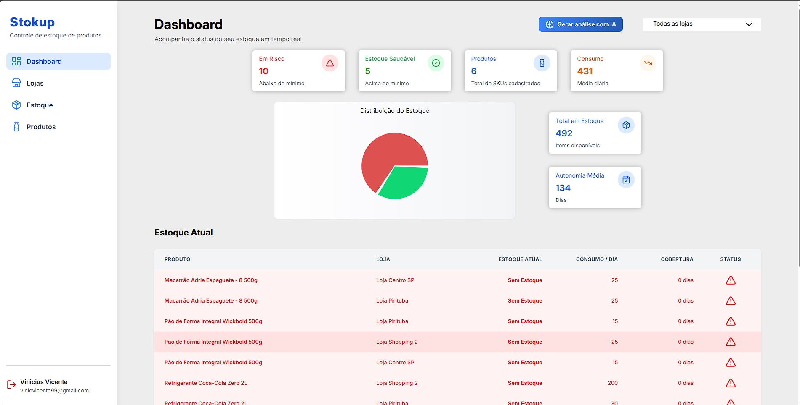
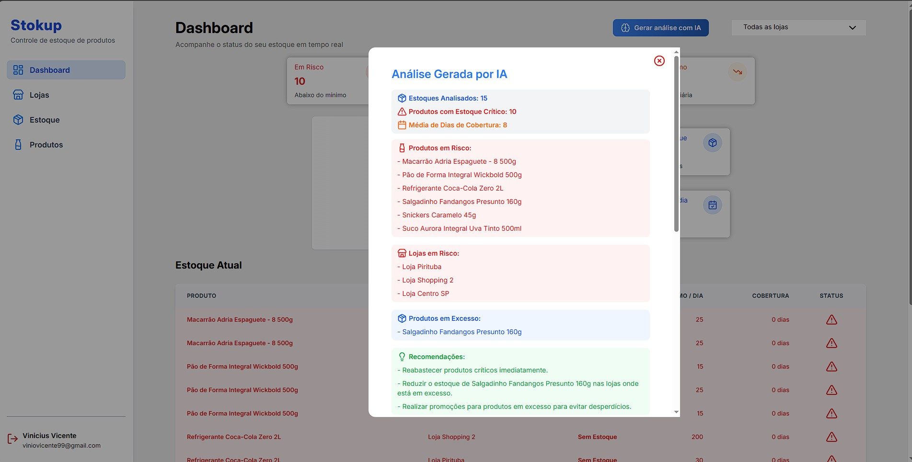
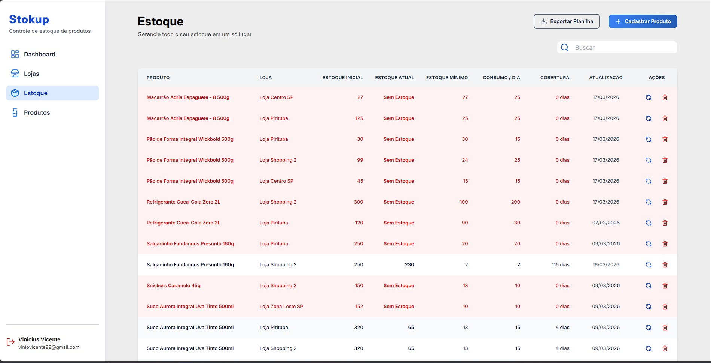
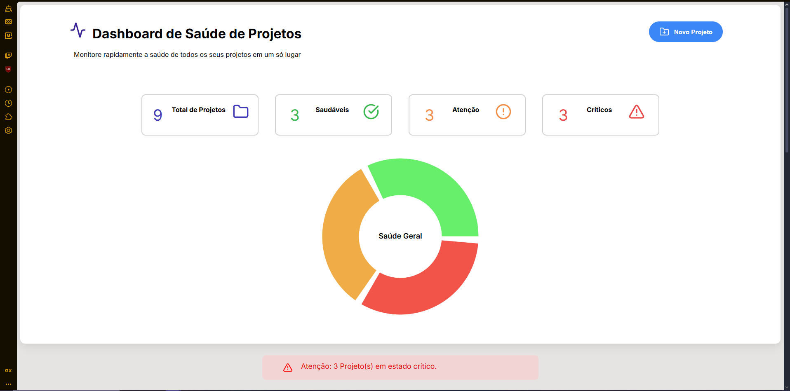
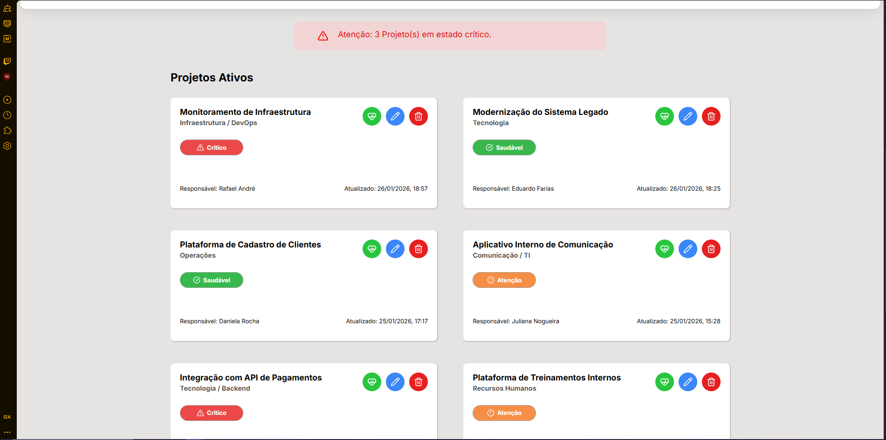

# 👋 Olá, eu sou Vinicius Vicente

### Desenvolvedor Fullstack Júnior | React • Node.js • TypeScript • APIs REST

💡 Desenvolvo **APIs escaláveis e integradas**, conectando múltiplos serviços, modelando dados e aplicando boas práticas de arquitetura.  
🧠 Experiência prática com **Node.js, TypeScript, PostgreSQL, Python (FastAPI), integração com IA (OpenAI) e sistemas distribuídos**.  
☁️ Deploy e estruturação de aplicações com **AWS**.  

---

## 🚀 Stack Principal (Backend)

- **Node.js** – desenvolvimento de APIs REST  
- **TypeScript** – tipagem e escalabilidade  
- **Fastify & Express** – construção de APIs performáticas  
- **PostgreSQL & MySQL** – modelagem e persistência de dados  
- **Python (FastAPI)** – APIs auxiliares e processamento de dados  
- **Pandas & OpenPyXL** – manipulação e exportação de dados  
- **Integração com IA (OpenAI API)** – geração de insights automatizados  
- **Jest** – testes automatizados  
- **AWS (S3, CloudFront)** – deploy e hospedagem  
- **Docker** – containers para desenvolvimento  
- **Git** – versionamento colaborativo  

### **Front-End**
- React  
- Angular  
- TailwindCSS  
- HTML, CSS  

## 📂 Projetos Relevantes

## 🧠 1️⃣ Stokup — Sistema de gestão e previsão de estoque multi-loja

Sistema completo simulando ambiente corporativo, com separação de serviços e foco em **escalabilidade e integração entre APIs**.

### 💥 Problema
Falta de visibilidade sobre estoque distribuído entre lojas e dificuldade na tomada de decisão baseada em dados.

### 🚀 Solução
Plataforma que centraliza dados de estoque, aplica regras de negócio e gera **insights automatizados com IA**, além de permitir exportação estruturada de dados.

---

### ⚙️ Backend Principal (Node.js)

- API REST desenvolvida com **Node.js e TypeScript**  
- Implementação de **regras de negócio reais** (ex: exclusão condicionada a estoque zerado)  
- CRUD completo de entidades  
- Modelagem relacional com **PostgreSQL**  
- Estruturação modular visando **manutenção e escalabilidade**  
- Arquitetura preparada para evolução em **microsserviços**  

---

### 🧠 IA e Insights Automatizados

- Integração com **API da OpenAI**  
- Geração de insights sobre estoque com base nos dados  
- Apoio à tomada de decisão através de análise automatizada  

---

### 📦 API de Exportação (Python)

- API desenvolvida com **FastAPI**  
- Endpoint para exportação de dados em **Excel (XLSX)**  
- Processamento de dados com **Pandas**  
- Geração de planilhas com **OpenPyXL**  
- Integração entre serviços (Node.js ↔ Python)  

---

### 🛠️ Tecnologias

- Node.js, TypeScript  
- PostgreSQL  
- Python (FastAPI)  
- Pandas, OpenPyXL  
- OpenAI API  
- React (interface)  
- AWS  

---

### ☁️ Deploy
AWS S3 (Static Website Hosting)

---

### 🖼️ Telas

  
  
  

---

### 🔗 Acesso
http://stokup-frontend.s3-website.us-east-2.amazonaws.com/login

---

## 📊 2️⃣ Dashboard de Saúde de Projetos

Sistema para monitoramento de projetos e identificação de riscos.

**Backend:** Node.js, PostgreSQL, APIs REST  
**Frontend (apoio):** React + Recharts  
**Deploy:** AWS S3  

**🖼️ Telas**

  
  

**🔗 Acesso**
http://project-health-frontend.s3-website.us-east-2.amazonaws.com/projects-dashboard

---

## 📝 3️⃣ Dashboard e Gerenciamento de Posts

Sistema para gestão e publicação de conteúdo.

**Backend:** Node.js, MySQL, APIs REST  
**Frontend (apoio):** Angular  
**Deploy:** AWS S3 + CloudFront  

**🖼️ Telas**

  

---

## 🌟 Competências Técnicas

### **Back-End (Principal)**
- Node.js, TypeScript  
- Express, Fastify  
- APIs REST  
- Arquitetura em camadas  
- Regras de negócio e validação  
- Tratamento de erros centralizado  
- Integração entre serviços (Node.js + Python)  
- PostgreSQL, MySQL  
- FastAPI  
- Pandas, OpenPyXL  
- Integração com IA (OpenAI API)  
- Testes com Jest  
- AWS  
- Docker  
- Git  

### **Front-End (Apoio)**
- React, Angular  
- TailwindCSS, HTML, CSS  

---

## 📫 Contato

- [LinkedIn](https://www.linkedin.com/in/vinicius-vicente-frontend/?_l=pt_BR)  
- Email: viniovicente99@gmail.com
